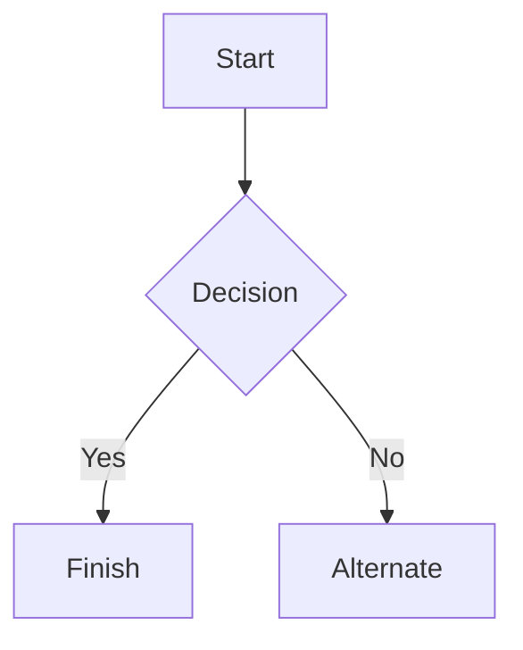

# Nombre Repositorio

## Guia de instalación

```bash
Comandos necesarios para arrancar e instalar el proyecto.
```
## Instrucciones de uso

## Diagrama de flujo


## Contribución 
Participantes activos.

## Temas legales
1. Argumento 1
2. Argumento 2
3. Argumento 3
    1. Articulo 3a
    2. Articulo 3b
       
## Colaboradores

| Colaborador   | Repositorio   |
| ------------- |:-------------:|
| Nombre Colaboraor      | [repositorio](https://github.com/)     |
| Nombre Colaboraor      | [repositorio](https://github.com/)     |


